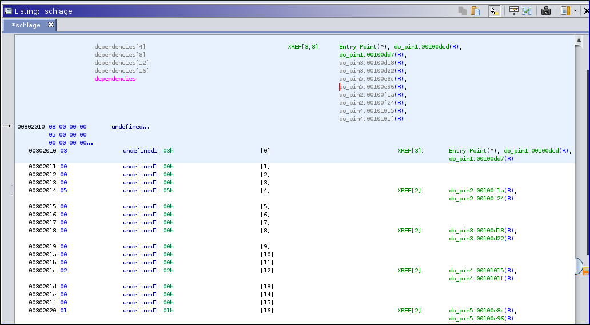

# Dam CTF 2020: Rev: Schlage
**Category:** Reverse Engineering **Points:** 406 points
</br></br>
**Description:**</br>
I went to the hardware store yesterday and bought a new lock, for some reason it came on a flash drive. Can you figure out how to unlock it? I really need to get into my apartment.</br>
Rather than traditional lock picks, you may find this, that, or this other expensive-looking thing to be helpful.
> nc chals.damctf.xyz 31932

**Attachment:** [schale](schlage) (sha256sum: b2f0bc5f5eb5ca174f06fcecc5c7ce6b5fafcafd457beb7141458212dfeb78b6)

## Solution
```
$ file schlage
schlage: ELF 64-bit LSB shared object, x86-64, version 1 (SYSV), dynamically linked, interpreter /lib64/ld-linux-x86-64.so.2, for GNU/Linux 3.2.0, BuildID[sha1]=741a1767941f68cf3da76cd0bee54d53f540be87, not stripped
```

Let's run it:
```
$ ./schlage
*** WELCOME TO THE SCHLAGE 9000 ***
***    AUTHORIZED USERS ONLY    ***

          ------------
         /            \
        /   --------   \
       /   /        \   \
      /   /          \   \
    ========================
    |                      |
    |    |=====><=====|    |  Pin 1
    |    |=====><=====|    |  Pin 2
    |    |=====><=====|    |  Pin 3
    |    |=====><=====|    |  Pin 4
    |    |=====><=====|    |  Pin 5
    |                      |
    ========================

Which pin would you like to open?
> 1
Hmm, this pin won't budge!

          ------------
         /            \
        /   --------   \
       /   /        \   \
      /   /          \   \
    ========================
    |                      |
    |    |=====><=====|    |  Pin 1
    |    |=====><=====|    |  Pin 2
    |    |=====><=====|    |  Pin 3
    |    |=====><=====|    |  Pin 4
    |    |=====><=====|    |  Pin 5
    |                      |
    ========================

Which pin would you like to open?
> 2
Hmm, this pin won't budge!

          ------------
         /            \
        /   --------   \
       /   /        \   \
      /   /          \   \
    ========================
    |                      |
    |    |=====><=====|    |  Pin 1
    |    |=====><=====|    |  Pin 2
    |    |=====><=====|    |  Pin 3
    |    |=====><=====|    |  Pin 4
    |    |=====><=====|    |  Pin 5
    |                      |
    ========================

Which pin would you like to open?
> 3
Give me a number!
> 9
Nope!

          ------------
         /            \
        /   --------   \
       /   /        \   \
      /   /          \   \
    ========================
    |                      |
    |    |=====><=====|    |  Pin 1
    |    |=====><=====|    |  Pin 2
    |    |=====><=====|    |  Pin 3
    |    |=====><=====|    |  Pin 4
    |    |=====><=====|    |  Pin 5
    |                      |
    ========================

Which pin would you like to open?
> 
```

It looks like that there's an order to pick the pins, and they open if we give them the right number.
Let's open it with ghidra:</br>
```c
undefined8 main(void)
{
  char cVar1;
  undefined4 uVar2;
  
  puts("*** WELCOME TO THE SCHLAGE 9000 ***");
  puts("***    AUTHORIZED USERS ONLY    ***");
  while (cVar1 = is_lock_unlocked(), cVar1 != '\x01') {
    print_lock();
    uVar2 = get_pin();
    switch(uVar2) {
    case 1:
      do_pin1();
      break;
    case 2:
      do_pin2();
      break;
    case 3:
      do_pin3();
      break;
    case 4:
      do_pin4();
      break;
    case 5:
      do_pin5();
    }
  }
  print_lock();
  puts("Congratulations on opening the lock! I really needed to get back into my apartment.");
  puts("Here, have a flag for your troubles:");
  print_flag();
  return 0;
}
```

The dependencies, the order for the pins to be picked.
<p align=center></p>

In the image above we can see that `do_pin1()` needs `do_pin3()` to open, `do_pin2()` needs `do_pin5()`, `do_pin3()` doesn't need any, `do_pin4()` needs `do_pin2()` and `do_pin5()` needs `do_pin1()`.</br>
Thus, the order is: `do_pin3() do_pin1() do_pin5() do_pin2 do_pin4()`

Let's see the function `do_pin3()`:
```c

void do_pin3(void)
{
  int iVar1;

  if ((dependencies._8_4_ == 0) ||
     (*(char *)((long)&pins + (long)(dependencies._8_4_ + -1)) == '\x01')) {
    puts("Give me a number!");
    iVar1 = get_int();

    /*In the listing there's an instruction doing user_input ^ 0xdeadbeef that is not
	shown in the decompiler.
    user_input ^ 0xdeadbeef == 0x13371337*/
    if (iVar1 == -0x32655228) {
      pins._2_1_ = 1;
      puts("Great!");
    }
    else {
      puts("Nope!");
    }
  }
  else {
    puts("Hmm, this pin won\'t budge!");
  }
  return;
}
```
The number is 0xdeadbeef ^ 0x13371337

Let's see the function `do_pin1()`
```c
void do_pin1(void)

{
  long in_FS_OFFSET;
  byte local_1e;
  int local_1c;
  byte local_16 [6];
  long local_10;

  local_10 = *(long *)(in_FS_OFFSET + 0x28);
  local_16[0] = 0x3e;
  local_16[1] = 0x57;
  local_16[2] = 0x81;
  local_16[3] = 0xd3;
  local_16[4] = 0x25;
  local_16[5] = 0x93;
  if ((dependencies._0_4_ == 0) ||
     (*(char *)((long)&pins + (long)(dependencies._0_4_ + -1)) == '\x01')) {
    puts("Number please!");
    local_1e = get_int();
    local_1c = 0;
    while (local_1c < 6) {
      local_1e = local_1e ^ local_16[local_1c];
      local_1c = local_1c + 1;
    }

    /* user_input ^ 0x3e ^ 0x57 ^ 0x81 ^ 0xd3 ^ 0x25 ^ 0x93 == 0xee*/
    if (local_1e == 0xee) {
      pins._0_1_ = 1;
      puts("Great!");
    }
    else {
      puts("Nope!");
    }
  }
  else {
    puts("Hmm, this pin won\'t budge!");
  }
  if (local_10 != *(long *)(in_FS_OFFSET + 0x28)) {
                    /* WARNING: Subroutine does not return */
    __stack_chk_fail();
  }
  return;
}
```
The number is (0x3e ^ 0x57 ^ 0x81 ^ 0xd3 ^ 0x25 ^ 0x93 ^ 0xee)

Let's see the function `do_pin5()`:
```c
void do_pin5(void)
{
  int iVar1;
  int iVar2;

  if ((dependencies._16_4_ == 0) ||
     (*(char *)((long)&pins + (long)(dependencies._16_4_ + -1)) == '\x01')) {
    srand(0x42424242);
    puts("I bet you can\'t guess my random number!");
    iVar1 = get_int();
    iVar2 = rand();
    if (iVar1 == iVar2) {
      puts("Wow! That was some impressive guessing.");
      pins._4_1_ = 1;
    }
    else {
      puts("Good try!");
    }
  }
  else {
    puts("Hmm, this pin won\'t budge!");
  }
  return;
}
```
They are called PSEUDOrandom numbers for a reason ;b</br>
The number will always be 1413036362

Let's see the function `do_pin2()`:
```c
void do_pin2(void)
{
  int iVar1;
  int iVar2;
  ulong uVar3;

  if ((dependencies._4_4_ == 0) ||
     (*(char *)((long)&pins + (long)(dependencies._4_4_ + -1)) == '\x01')) {
    uVar3 = time((time_t *)0x0);
    puts("Hmm, a little piece of paper just fell out of the lock with some random numbers on it!");
    puts("I wonder what it means?");
    printf("%d\n",uVar3 & 0xffffffff);
    srand((uint)uVar3);
    puts("What\'s your favorite number?");
    iVar1 = get_int();
    iVar2 = rand();
    if (iVar1 == iVar2) {
      puts("Woah, that\'s the lock\'s favorite number too! Small world, eh?");
      pins._1_1_ = 1;
    }
    else {
      puts("To each their own I guess!");
    }
  }
  else {
    puts("Hmm, this pin won\'t budge!");
  }
  return;
}
```
Is the same as in the do_pin5, only now the seed instead of being 0x42424242 is the number they send us.

Let's see the function `do_pin4()`:
```c
void do_pin4(void)
{
  int iVar1;
  size_t sVar2;
  long in_FS_OFFSET;
  int local_48;
  int local_44;
  undefined8 local_38;
  undefined8 local_30;
  undefined8 local_28;
  undefined8 local_20;
  long local_10;

  local_10 = *(long *)(in_FS_OFFSET + 0x28);
  local_38 = 0;
  local_30 = 0;
  local_28 = 0;
  local_20 = 0;
  if ((dependencies._12_4_ == 0) ||
     (*(char *)((long)&pins + (long)(dependencies._12_4_ + -1)) == '\x01')) {
    puts("What\'s your favorite sentence?");
    fgets((char *)&local_38,0x20,stdin);
    sVar2 = strcspn((char *)&local_38,"\n");
    *(undefined *)((long)&local_38 + sVar2) = 0;
    iVar1 = rand();
    local_48 = 0;
    sVar2 = strlen((char *)&local_38);
    local_44 = 0;
    while (local_44 < (int)sVar2) {
      local_48 = local_48 + ((int)*(char *)((long)&local_38 + (long)local_44) ^ iVar1 % 10 + 0x41U);
      local_44 = local_44 + 1;
    }
    if (local_48 == 0x123) {
      puts("Such a cool sentence!");
      pins._3_1_ = 1;
    }
    else {
      puts("Not a big fan of that sentence");
    }
  }
  else {
    puts("Hmm, this pin won\'t budge!");
  }
  if (local_10 != *(long *)(in_FS_OFFSET + 0x28)) {
                    /* WARNING: Subroutine does not return */
    __stack_chk_fail();
  }
  return;
}
```
Here is a bit of guessing, and everytime we try to pick the pin4 it changes, so we try until we get it.

#### Exploit
```python
from pwn import *
from ctypes import *

cdll.LoadLibrary('/lib/x86_64-linux-gnu/libc.so.6')
libc = CDLL('/lib/x86_64-linux-gnu/libc.so.6')


local = True

if local:
    p = process('./schlage')
else:
    p = remote('chals.damctf.xyz', 31932)

def debug():
    gdbscript = 'b* do_pin4+279'
    gdb.attach(p, gdbscript=gdbscript)
#debug()

def pin_1():
    p.recvuntil('Which pin would you like to open?')
    p.sendline('1')
    p.recvuntil('> ')
    n = str(0x3e ^ 0x57 ^ 0x81 ^ 0xd3 ^ 0x25 ^ 0x93 ^ 0xee)
    p.sendline(n)
    
def pin_2():
    p.recvuntil('Which pin would you like to open?')
    p.sendline('2')
    p.recvuntil('I wonder what it means?\n')
    seed = int(p.recvline().strip())
    print(seed)
    libc.srand(seed)
    n = libc.rand()
    print(str(n))
    p.recvuntil('What\'s your favorite number?')
    p.sendline(str(n))  
    
def pin_3():
    p.recvuntil('Which pin would you like to open?')
    p.sendline('3')
    p.recvuntil('> ')
    n = str(0xdeadbeef ^ 0x13371337)
    p.sendline(n)

def pin_4():
    p.recvuntil('Which pin would you like to open?')
    p.sendline('4')
    p.recvuntil('What\'s your favorite sentence?')
    p.sendline('\x22\x22\x22')

def pin_5():
    p.recvuntil('Which pin would you like to open?')
    p.sendline('5')
    p.recvuntil('> ')
    libc.srand(0x42424242)
    n = str(libc.rand())
    log.info('pin5 n is '+n)
    p.sendline(n)

pin_3()
pin_1()
pin_5()
pin_2()

sentence = b''
while('cool' not in str(sentence)):
    pin_4()
    sentence = p.recvlines(2)
    print(sentence)
    

p.interactive()

```

## Flag
> dam{p1ck1NG_l0Ck5_w1TH_gdB}
