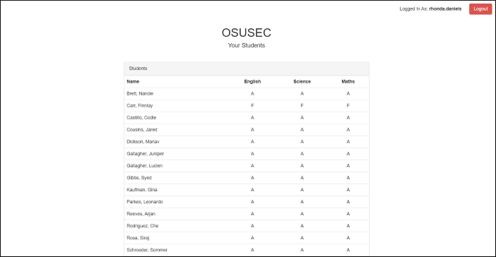
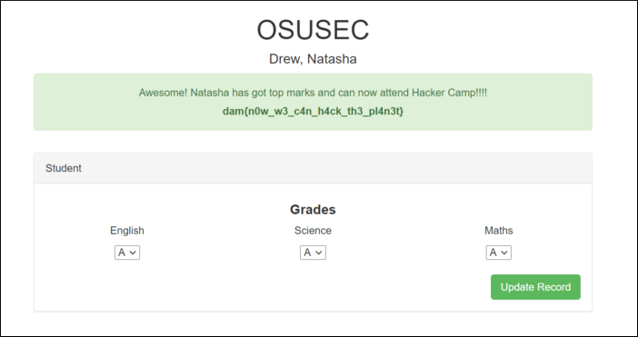

# Dam CTF 2020: Web: hacker-camp
</br>**Category:** Web **Points:** 371 points
</br></br>
**Description:**</br>
Natasha Drew wants to go to Hacker Camp but doesn't have the grades she needs. Hack into the student portal and change her grades so she can attend.
> hacker-camp.chals.damctf.xyz

## Solution
Going to the webpage, we are presented with a login form that asks us for the username and password.
<p align=center></p>

let's try some guesses:</br>
admin:admin => nope</br>
admin:password => nope</br>
admin:password123 => nope</br>
admin:password123! => nope</br>

Looks like brute force is not the way. Let's try sql injections:</br>
username:' or '1'='1</br>
password:' or '1'='1</br>
And we're in.

<p align=center></p>

Now we have a table with some students and they're grades, but no form to change the grades and no student called Natasha Drew. Looking up the [source code](dashboard.html) we have two interesting parts.

Part1 - student id:
```html
<tr>
    <td data-id="TXlyb25fV2lsa2lucw==" class="student-link">Wilkins, Myron</td>
    <td class="text-center">A</td>
    <td class="text-center">A</td>
    <td class="text-center">A</td>
</tr>
```

```
$ echo -n 'TXlyb25fV2lsa2lucw==' | base64 -d
Myron_Wilkins
```
So, the students ids are firstname_lastname encoded with base64
```
$ echo -n 'Natasha_Drew' | base64
TmF0YXNoYV9EcmV3
```

Part2 - Being admin:
```html
<script>
    var staff = {
        admin   :   false,
        name    :   'rhonda.daniels'
    }
</script>
```

Now that we know Natasha's id and how to be the admin, we need to find a way to change her grades. On the Debugger tab of the Web Developer Tools in Firefox we have a javascript file [app.min.js](app.min.js):

```javascript
function(s,objectName){
  setupLinks = function(){
    if( s.admin ){
      var sl = document.getElementsByClassName("student-link");
      for (i = 0; i < sl.length; i++) {
        let name = sl[i].innerHTML;
        sl[i].style.cursor='pointer';
        sl[i].addEventListener("click", function(){
          window.location = '/update-' + objectName + '/' + this.dataset.id;
        });
      }
    }
  };

  updateForm = function(){ 
    var submitButton = document.getElementsByClassName("update-record"); 
    if( submitButton.length === 1 ){ 
      submitButton[0].addEventListener("click", function(){
        var english = document.getElementById("english");
        english = english.options[english.selectedIndex].value;
        var science = document.getElementById("science");
        science = science.options[science.selectedIndex].value;
        var maths = document.getElementById("maths");
        maths = maths.options[maths.selectedIndex].value;
        var grades = new Set(["A","B","C","D","E","F"]);

        if (grades.has(english) && grades.has(science) && grades.has(maths) ) {
          document.getElementById('student-form').submit();
        }
        else{ 
          alert('Grades should only be between A - F');
        }
      });
    }
  };

setupLinks();
updateForm();
})
(staff,'student');
```

There are two main functions, setupLinks() and updateForm().</br>
What setupLinks() does is, if you are the admin, makes every name on the table, a link to the update page. The updateForm, updates the grades of the student.</br>

Going to hacker-camp.chals.damctf.xyz/update-student/TmF0YXNoYV9EcmV3 we can change Natasha's grades.
<p align=center></p>

## Flag
> dam{n0w_w3_h4ck_th3_pl4n3t}
