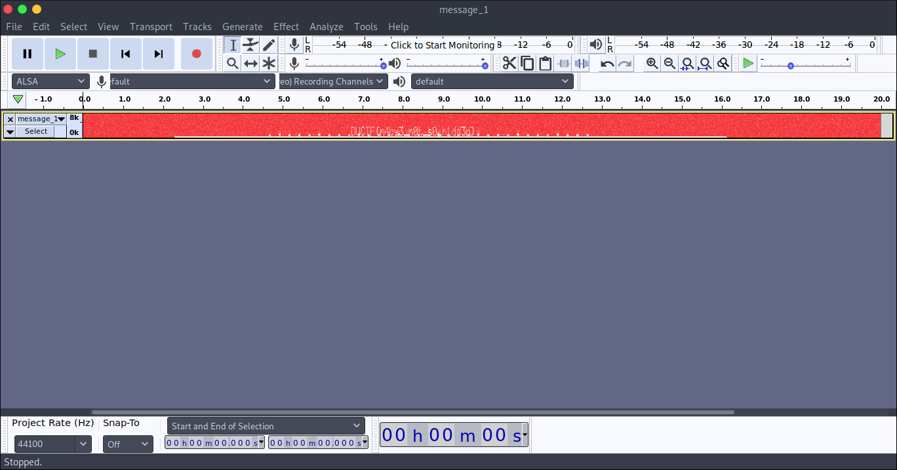

# DownUnder CTF 2020: Forensics: On th spectrum
 **Category:** Forensics **Points:** 100 points
  
**Description:** 
My friend has been sending me lots of WAV files, I think he is trying to communicate with me, what is the message he sent?
 
**Attachment:** [message_1.wav](message_1.wav) (sha256: 069dacbd6d6d5ed9c0228a6f94bbbec4086bcf70a4eb7a150f3be0e09862b5ed)

## Solution
Open the file in Audacity in the spectogram form, and collapse the track for a better view:

## Flag
> DUCTF{m4by3_n0t_s0_h1dd3n}
