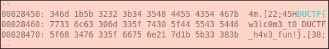

# DownUnder CTF 2020: Misc: Welcome!
</br>**Category:** Miscellaneous **Points:** 100 points
</br></br>
**Description:**</br>
Welcome to DUCTF!
> ssh ductf@chal.duc.tf -p 30301

Password `DUCTF`
</br>

## Solution
When we ssh into the machine, a bunch of messages pop up welcoming us to the CTF, filling our entire screen. But if we look closely we see that some messages are actually the flag.

In order to get the flag, we can output our ssh into a file and search for the flag there.

```
$ ssh ductf@chal.duc.tf -p 30301 > ssh.out
$ xxd ssh.out | grep -A2 DUCTF{
```

<p align=center></p>

## Flag
> DUCTF{w3lc0m3_t0_DUCTF_h4v3_fun!}
