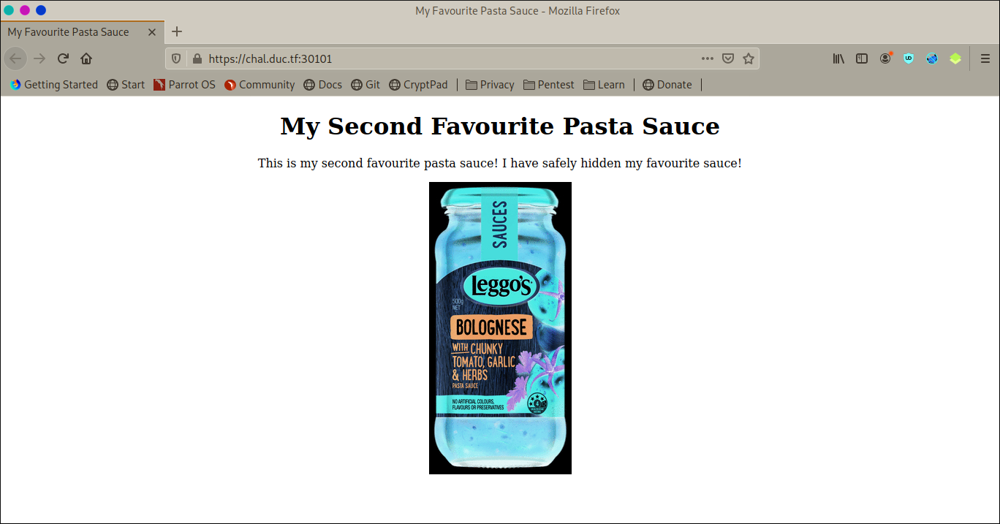

# DownUnder CTF 2020: Web: Loggos
</br>**Category:** Web **Points:** 100 points
</br></br>
**Description:**</br>
I <3 Pasta! I won't tell you what my special secret sauce is though!

https://chal.duc.tf:30101
</br>

## Solution
Going to the site in the description, it seems that it's just a static page.

<p align=center></p>

Let's inspect the page:
There was a problem, when we right click on the page, an alert with the message 'not allowed' pops up.
So we need to go to our menu's browser, click on 'Web Developer' and then in 'Inspector'.

The page source:
```html
<html>
<head>
        <title>My Favourite Pasta Sauce</title>
        <style>
            body {
                background-color: black;
                color: white
            }
            .main-body {
                margin: auto;
                text-align: center;
            }
        </style>
        <script src="disableMouseRightClick.js"></script>
    </head>

    <body>
        <script>
            document.onkeydown = function(e) {
                if (e.ctrlKey && 
                    (e.keyCode === 67 || 
                    e.keyCode === 86 || 
                    e.keyCode === 85 || 
                    e.keyCode === 117)) {
                        alert('not allowed');
                    return false;
                } else {
                    return true;
                }
            };
        </script>

        <div class="main-body">
            <h1>My Second Favourite Pasta Sauce</h1>
            <p>This is my second favourite pasta sauce! I have safely hidden my favourite sauce!</p>
            <!-- almost there -->
            
        </div>
    
</body>
</html>
```

There's a comment that says 'almost there' by it we presume that we are on the right track, meaning the flag will be in the source, so if it's not here, maybe it's in a script source, and this pages embeds a script called `disableMouseRightClick.js`. We can see the source code of this script in the debugger tab in the web developer tools.

The disableMouseRightClick.js source code:
```js
document.addEventListener('contextmenu', function(e) {
    e.preventDefault();
    alert('not allowed');
});

  //the source reveals my favourite secret sauce 
  // DUCTF{n0_k37chup_ju57_54uc3_r4w_54uc3_9873984579843} 

```

And the flag is indeed in the comments.

## Flag
> DUCTF{n0_k37chup_ju57_54uc3_r4w_54uc3_9873984579843}
