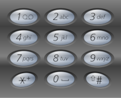

# HTB-Challenges: Crypto: Bank Heist
**Category:** Cryptography **Points:** 20 points **Date:** 08/05/2019
</br>
**Zip Password:** hackthebox
**Flag format:** HTB{*some_text*}
</br>
**Description:**
You get to the scene of a bank heist and find that you have caught one person. Under further analysis of the persons flip phone you see a message that seems suspicious. Can you figure out what the message to put this guy in jail?

## Write-up
We are given the following message:
```
444333 99966688 277733 7773323444664 84433 22244474433777, 99966688 277733 666552999. 99966688777 777744277733 666333 84433 443344477778 4447777 44466 99966688777 4466688777733. 84433 5533999 8666 84433 55566622255 4447777 22335556669. 4666 8666 727774447777.

47777888 995559888 4555 47777888 44999988 666555997 : 8555444888477744488866888648833369!!
```
Because the description says that it's a message from a flip phone, this must be encrypted with SMS Phone Tap Code Cipher which basically is when you use your phone's telephone keypad to write messages.</br>
</br>
Going to [this](https://www.dcode.fr/multitap-abc-cipher) online decoder and inputing our message we are given the following result:
```
IF YOU ARE READING THE CIPHER, YOU ARE OKAY. YOUR SHARE OF/ODE/OED THE HEIST GHS/HGS/IRP/IS IN/IMM YOUR HOUSE THE KEY TO THE LOCK GHS/HGS/IRP/IS BELOW. GO TO PARIS. 
GSV XLWV GL GSV HZU OLXP TLIVGRIVNVMGUFMW!!
```
So now we have another encrypted message `GSV XLWV GL GSV HZU OLXP TLIVGRIVNVMGUFMW!!`
Because we aren't given a key I suspect is a substitution cipher.
I alse speculate that the first word `GSV` is the substitution for the word `THE` because it's a very common word and appears twice. Googgling "gsv the substitution cipher" the first result is to a [page](https://cryptii.com/pipes/alphabetical-substitution) that does an alphabetic substitution, meaming `A` substitutes to `Z`, `B` to `Y` and so forth.</br></br>
Using the online decoder we get the message:</br>
`the code to the saf lock : goretirementfund`</br>
Following the flag format, we get:</br>
`HTB{GORETIREMENTFUND}`
