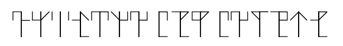
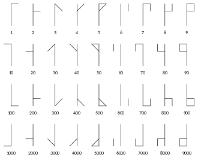

# HTB-Challenges: Crypto: Templed
**Category:** Cryptography **Points:** 10 points **Date:** 27/11/2019
 
**Zip Password:** hackthebox
**Flag format:** HTB{*some_text*}
 
**Description:**
I found the following message in a temple, I had the sensation that they were hiding something. Could you help me discover what it was?

## Write-up
We are given the following image: 

At first I thought that it was a font but after hours of scrolling throught different kind of fonts I decide to take a look at the [forum](https://forum.hackthebox.eu/discussion/2476/templed) where I saw the comment from farbs saying "Googling something like 'temple symbol crypto' is enough". So that's what I did and stumbled upon a cipher called ["The Ciphers of the Monks"](https://en.wikipedia.org/wiki/The_Ciphers_of_the_Monks). 
Here is the cipher: 

The cipher works by combining the numbers and that makes an unique symbol. 
For example the number 1234 will be the combination of the symbols 1000, 200, 30 an 4 becoming the symbol: 
 
Because we know the flag format, we know that the first symbol will translate to 'H' checking the ascii table we get that 72 is the decimal number for 'H', and translating the symbol, we get the number 72. This means that we are on the right track, now we need to manually do the same for the rest of the symbols.

The flag is:
`HTB{M0Nks_kN3w!}`
