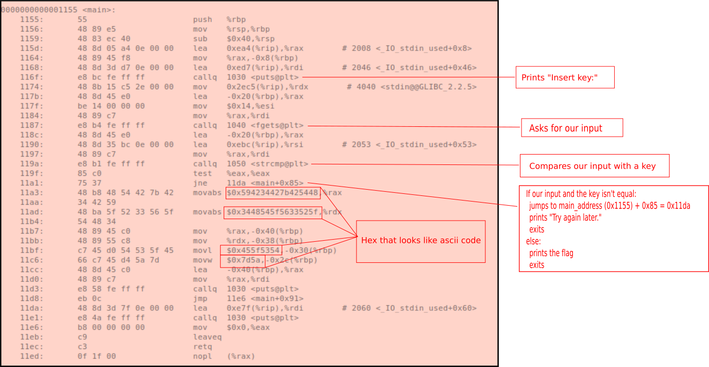

# HTB-Challenges: Reversing: Baby RE
**Category:** Reverse Engineering **Points:** 10 points **Date:** 15/10/2019</br>
**Description:**
Show us your basic skills! (P.S. There are 4 ways to solve this, are you willing to try them all?)

## TL;DR
First method: strings
</br>
Second method: ltrace
</br>
Thirth method: objdump
</br>
Fourth method: ghidra

## Write-up
It says that we can find the flag in 4 different ways so let's do it.

### First method
The first method will be the most obvious for when we have an easy reverse engineering challenge: `strings`
```
$ strings baby
```
And among some gibberish we get:
```
HTB{B4BYH
_R3V_TH4H
TS_Ef
[]A\A]A^A_
Dont run `strings` on this challenge, that is not the way!!!!
Insert key:
abcde122313
Try again later.
```
We weren't lucky, *strings* is not the way.
</br>
But we did get a string that looks like our key:
```
$ ./baby
Insert key:
abcde122313
HTB{B4BY_R3V_TH4TS_EZ}
```

### Second method
The program is comparing our input with their key, if it's using a function from a library to do it, for example strcmp(), we can use `ltrace` to intercept the function and its arguments.
```
$ ltrace ./baby
puts("Insert key: "Insert key: 
)                                                              = 13
fgets(AAAA
"AAAA\n", 20, 0x7fc01dcdb980)                                  = 0x7ffc0d276120
strcmp("AAAA\n", "abcde122313\n")                              = -32
puts("Try again later."Try again later.
)                                                              = 17
+++ exited (status 0) +++
```
We gave the input "AAAA" and the program compared it to "abcde122313".
</br>
Now we can give the correct key to the program:
```
$ ./baby
Insert key:
abcde122313
HTB{B4BY_R3V_TH4TS_EZ}
```
### Third method
Doing a static analysis with `objdump` on the main function
```
$ objdump x -D baby
```


If we convert the hexadecimals to ascii, invert it (because it's little endian) and then concatenate it, we get the flag.
```python
a = bytearray.fromhex('594234427b425448').decode()[::-1]
b = bytearray.fromhex('3448545f5633525f').decode()[::-1]
c = bytearray.fromhex('455f5354').decode()[::-1]
d = bytearray.fromhex('7d5a').decode()[::-1]
print(a+b+c+d)
```
```
HTB{B4BY_R3V_TH4TS_EZ}
```

### Fourth method
We could open the file with ghidra and decompile it. Once is decompiled we see the hexadecimals and then we have to do the same thing we did in the third method. Or we would see the key and run the program with the proper key.
