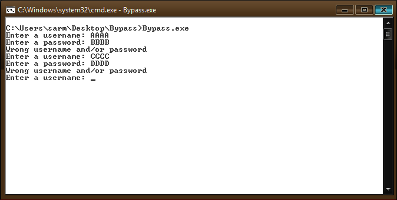
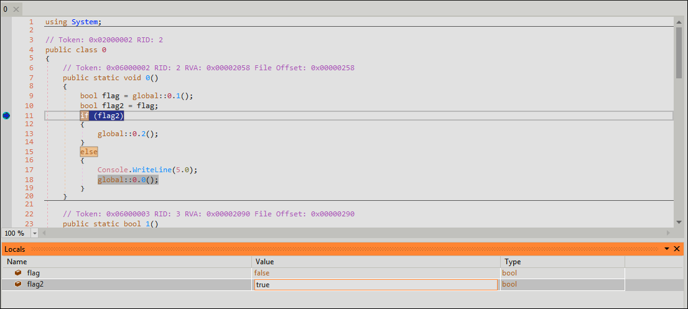
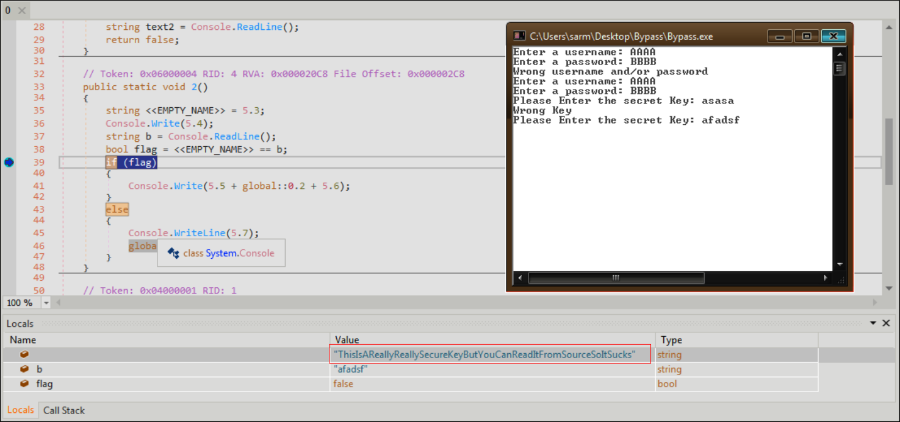

# HTB-Challenges: Reversing: Bypass
**Category:** Reverse Engineering **Points:** 20 points **Date:** 06/03/2020
</br>
**Zip Password:** hackthebox
**Flag format:** HTB{*some_text*}
</br>
**Description:**
The Client is in full control. Bypass the authentication and read the key to get the Flag.
</br>
## Write-up
```
$ file Bypass.exe
Bypass.exe: PE32 executable (console) Intel 80386 Mono/.Net assembly, for MS Windows
```

A portable executable 32 (PE32) format is a file format for executables, object code, DLLs and others used in 32-bit versions of Windows.
</br>
Since the executable is for Windows, we will switch to a Windows machine.
</br>
Let's run the executable to see what it does:


As shown, the program asks us for a username and password, tells us the credentials are wrong and asks us again and again.
</br>
To **bypass** this, we will use dnSpy (the x86 version because we are dealing with a PE**32**) to do a dynamic analysis, see what's going on and maybe change a few things in our favor to get the flag.

```cs
using System;

// Token: 0x02000002 RID: 2
public class 0
{
	// Token: 0x06000002 RID: 2 RVA: 0x00002058 File Offset: 0x00000258
	public static void 0()
	{
		bool flag = global::0.1();
		bool flag2 = flag;
		if (flag2)
		{
			global::0.2();
		}
		else
		{
			Console.WriteLine(5.0);
			global::0.0();
		}
	}

	// Token: 0x06000003 RID: 3 RVA: 0x00002090 File Offset: 0x00000290
	public static bool 1()
	{
		Console.Write(5.1);
		string text = Console.ReadLine();
		Console.Write(5.2);
		string text2 = Console.ReadLine();
		return false;
	}

	// Token: 0x06000004 RID: 4 RVA: 0x000020C8 File Offset: 0x000002C8
	public static void 2()
	{
		string <<EMPTY_NAME>> = 5.3;
		Console.Write(5.4);
		string b = Console.ReadLine();
		bool flag = <<EMPTY_NAME>> == b;
		if (flag)
		{
			Console.Write(5.5 + global::0.2 + 5.6);
		}
		else
		{
			Console.WriteLine(5.7);
			global::0.2();
		}
	}

	// Token: 0x04000001 RID: 1
	public static string 0;

	// Token: 0x04000002 RID: 2
	public static string 1;

	// Token: 0x04000003 RID: 3
	public static string 2 = 5.8;
}
```

Function 0 calls function 1 and stores what it returns in ```flag```.</br>
Function 1 asks us for username and password and then **always** returns false.</br>
Going back to function 0, now that ```flag==false```, ```flag2``` also becomes false because of it and therefore the if condition always returns false and executes the else block. Which prints "Wrong username and/or password" and then calls function 0 that doed everything the same way, making it an infinite cycle.</br>
To break this cycle, we need to make the if condition return true, thus flag2 needs to become true. In order to do this, we will put a breakpoint in the if condition, and when it hits it, we'll change the value of flag2 to true:


Once inside the if block, function 2 is called.</br>
Function 2 asks us to "Please enter the secret key:", then it compares our input with a string, if they match the flag is printed, if not it prints "Wrong key" and asks us again for the key. If we make another breakpoint in the if statement we can see the key:


Now the next time it asks us, we input the right key and get the flag.</br>
```HTB{SuP3rC00lFL4g}```</br>
**Note:** If the program exits before you can read the flag, just add a breakpoint at the end of function 2. 
