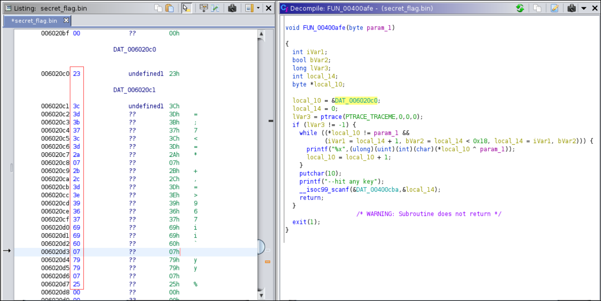

# HTB-Challenges: Reversing: Find The Secret Flag
**Category:** Reverse Engineering **Points:** 50 points **Date:** 14/09/2017
</br>
**Zip password:** hackthebox
**Flag format:** HTB{*some_text*}
</br>
**Description:**
 Find the secret flag and get the name of the creators of this challenge!

## Write-up
```
$ file secret_flag.bin
secret_flag.bin: ELF 64-bit LSB executable, x86-64, version 1 (SYSV), dynamically linked, interpreter /lib64/ld-linux-x86-64.so.2, for GNU/Linux 2.6.32, BuildID[sha1]=e8d44daa961ccb2cafc92c93b18b3edd522c0e74, stripped
```

Let's open it with ghidra:</br>


Main function is called FUN_004008fd let's change the name to main and go there:


Let's check out what function FUN_004009aa does, and see if we can make it return something different than 0, so we are able to call FUN_00400afe:


If we convert the following signed hexadecimal values (-0x22, -0x53, -0x42, -0x11) to unsigned hexadecimal values we get 0xdeadbeef.</br>
In order to return something different than 0, the file "/tmp/secret" needs to exist and read 0xdeadbeef.
```
$ python -c 'print "\xde\xad\xbe\xef"' > /tmp/secret
```

Function FUN_00400afe:


This function loops through the bytes in DAT_006020c0, xores each byte with the function parameter value and prints them in hexadecimal. From main we know that this parameter is the first program argument, and is an integer between 0 and 0x7f==128.

What bytes are store in DAT_006020c0?


What do we have to do?
We need to brute force the argument and convert the resulted values into ascii until it gives us a proper message.

```python
dat_006020c0 = [0x23, 0x3c, 0x3d, 0x3b, 0x37, 0x3c, 0x3d, 0x2a, 0x07, 0x2b, 0x2c, 0x3d, 0x3e, 0x39, 0x36, 0x37, 0x69, 0x69, 0x60, 0x07, 0x79, 0x79, 0x07, 0x25]

for i in range(0,128):
    print i
    for c in dat_006020c0:
        print chr(c ^ i),
```
Output:</br>
...</br>
88</br>
{ d e c o d e r _ s t e f a n o 1 1 8 _ ! ! _ }</br>
...</br>

So the flag is:
```
HTB{decoder_stefano118_!!_}
```
