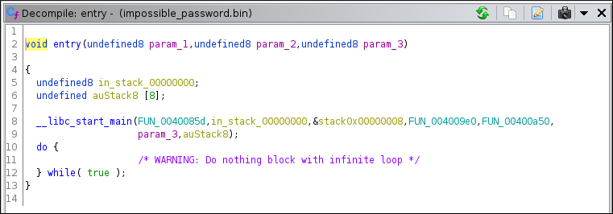
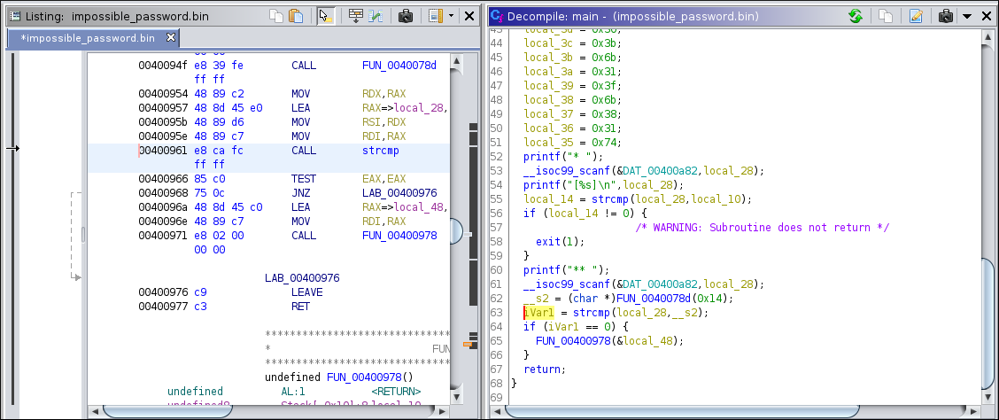
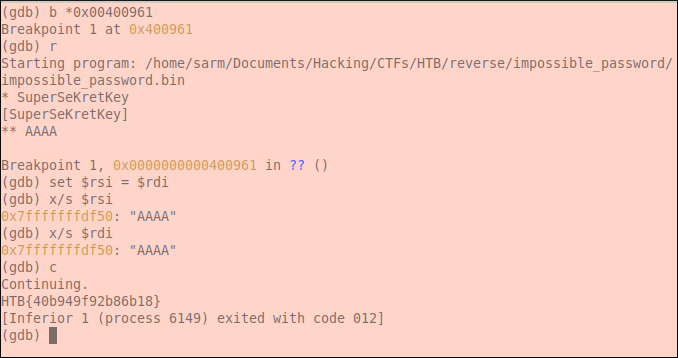

# HTB-Challenges: Reversing: Impossible Password
**Category:** Reverse Engineering **Points:** 30 points **Date:** 01/09/2017
</br>
**Zip password:** hackthebox
**Flag format:** HTB{*some_text*}
</br>
**Description:**
 Are you able to cheat me and get the flag?

## Write-up
```
$ file impossible_password.bin
impossible_password.bin: ELF 64-bit LSB executable, x86-64, version 1 (SYSV), dynamically linked, interpreter /lib64/ld-linux-x86-64.so.2, for GNU/Linux 2.6.32, BuildID[sha1]=ba116ba1912a8c3779ddeb579404e2fdf34b1568, stripped
```
Let's execute it:
```
./impossible_password.bin 
* AAAA
[AAAA]
```
We can observe that the program asks for input and then echoes it.</br>
Let's open it with ghidra:


Main function is called FUN_0040085d let's change the name to main and go there:
```c
void main(void)

{
  int iVar1;
  char *__s2;
  undefined local_48;
  undefined local_47;
  undefined local_46;
  undefined local_45;
  undefined local_44;
  undefined local_43;
  undefined local_42;
  undefined local_41;
  undefined local_40;
  undefined local_3f;
  undefined local_3e;
  undefined local_3d;
  undefined local_3c;
  undefined local_3b;
  undefined local_3a;
  undefined local_39;
  undefined local_38;
  undefined local_37;
  undefined local_36;
  undefined local_35;
  char local_28 [20];
  int local_14;
  char *local_10;
  
  local_10 = "SuperSeKretKey";
  local_48 = 0x41;
  local_47 = 0x5d;
  local_46 = 0x4b;
  local_45 = 0x72;
  local_44 = 0x3d;
  local_43 = 0x39;
  local_42 = 0x6b;
  local_41 = 0x30;
  local_40 = 0x3d;
  local_3f = 0x30;
  local_3e = 0x6f;
  local_3d = 0x30;
  local_3c = 0x3b;
  local_3b = 0x6b;
  local_3a = 0x31;
  local_39 = 0x3f;
  local_38 = 0x6b;
  local_37 = 0x38;
  local_36 = 0x31;
  local_35 = 0x74;
  printf("* ");
  __isoc99_scanf(&DAT_00400a82,local_28);
  printf("[%s]\n",local_28);
  local_14 = strcmp(local_28,local_10);
  if (local_14 != 0) {
                    /* WARNING: Subroutine does not return */
    exit(1);
  }
  printf("** ");
  __isoc99_scanf(&DAT_00400a82,local_28);
  __s2 = (char *)FUN_0040078d(0x14);
  iVar1 = strcmp(local_28,__s2);
  if (iVar1 == 0) {
    FUN_00400978(&local_48);
  }
  return;
}
```

As we already knew, it asks for our input and echoes it. But now we know that compares it with the string "SuperSeKretKey" and if it doesn't matches it, the program exits.
If the strings match, the program asks us for another input and compares it with the output of the function ```FUN_0040078d(0x14)``` let's see what function FUN_0040078d() does.
```c

void * FUN_0040078d(int param_1)

{
  int iVar1;
  time_t tVar2;
  void *pvVar3;
  int local_c;
  
  tVar2 = time((time_t *)0x0);
  DAT_00601074 = DAT_00601074 + 1;
  srand(DAT_00601074 + (int)tVar2 * param_1);
  pvVar3 = malloc((long)(param_1 + 1));
  if (pvVar3 != (void *)0x0) {
    local_c = 0;
    while (local_c < param_1) {
      iVar1 = rand();
      *(char *)((long)local_c + (long)pvVar3) = (char)(iVar1 % 0x5e) + '!';
      local_c = local_c + 1;
    }
    *(undefined *)((long)pvVar3 + (long)param_1) = 0;
    return pvVar3;
  }
                    /* WARNING: Subroutine does not return */
  exit(1);
}
```
Since function FUN_0040078d() uses the functions time() and srand() to manipulate the string that is going to be returned, our second input will be compared with a random and always different string.</br>
What we need to do is to change the variable ```pvVar3``` value while the program is running, for this we will use gdb.</br>
We will set a breakpoint where the strcmp() function is called and then change it's arguments to match.</br>
To know where to make the breakpoint, go to ghidra, and in the decompile window click the line where the strcmp() function is called, in the listing window, the respective instruction and it's address will be highlighted as seen in the screenshot below:




In ELF 64-bit the first two arguments of the functions are in the rdi and rsi registers, that is why we did ```set $rsi = $rdi``` so that their values would be the same.</br>
And we get the flag:
```
HTB{40b949f92b86b18}
```
