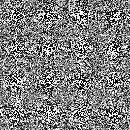
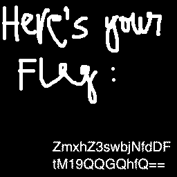

# CSAW CTF QUALS 2020: Crypto: Perfect Secrecy
 **Category:** Cryptography **Points:** 50 points
  
**Description:** 
Alice sent over a couple of images with sensitive information to Bob, encrypted with a pre-shared key. It is the most secure encryption scheme, theoretically...
 

## Solution

The challenge gives us two images:

<table>
		<tr>
				<td>Image 1</td>
				<td>Image 2</td>
		</tr>
		<tr>
				<td></td>
				<td></td>
		</tr>
</table>

 
As we can see the images are just static noise, and there's two of them, so we must need to combine them in a way to get the flag.

In order to combine the two images, we can open **image1.png** in [StegSolve](http://www.caesum.com/handbook/Stegsolve.jar), go to **analyse** > **image combiner**, choose **image2.png** and operate them with xor, which gives us: 

		

 

> $ echo -n 'ZmxhZ3swbjNfdDFtM19QQGQhfQ==' | base64 -d
>> flag{0n3_t1m3_P@d!}

 

## Flag
**flag{0n3_t1m3_P@d!}**
