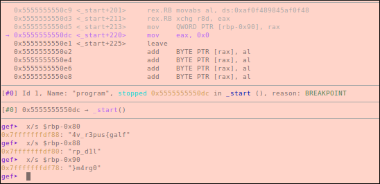

# CSAW CTF QUALS 2020: Rev: baby_mult
</br>**Category:** Reverse Engineering **Points:** 50 points
</br></br>
**Description:**</br>
Welcome to reversing! Prove your worth and get the flag from this neat little program!
</br>

## Solution

The challenge gives us a text file called **program.txt** with decimal numbers between 0 and 255, so we can assume that the numbers are bytes.

[program.txt](program.txt):
> 85, 72, 137, 229, 72, 131, 236, 24, 72, 199, 69, 248, 79, 0, 0, 0, 72, 184, 21, 79, 231, 75, 1, 0, 0, 0, 72, 137, 69, 240, 72, 199, 69, 232, 4, 0, 0, 0, 72, 199, 69, 224, 3, 0, 0, 0, 72, 199, 69, 216, 19, 0, 0, 0, 72, 199, 69, 208, 21, 1, 0, 0, 72, 184, 97, 91, 100, 75, 207, 119, 0, 0, 72, 137, 69, 200, 72, 199, 69, 192, 2, 0, 0, 0, 72, 199, 69, 184, 17, 0, 0, 0, 72, 199, 69, 176, 193, 33, 0, 0, 72, 199, 69, 168, 233, 101, 34, 24, 72, 199, 69, 160, 51, 8, 0, 0, 72, 199, 69, 152, 171, 10, 0, 0, 72, 199, 69, 144, 173, 170, 141, 0, 72, 139, 69, 248, 72, 15, 175, 69, 240, 72, 137, 69, 136, 72, 139, 69, 232, 72, 15, 175, 69, 224, 72, 15, 175, 69, 216, 72, 15, 175, 69, 208, 72, 15, 175, 69, 200, 72, 137, 69, 128, 72, 139, 69, 192, 72, 15, 175, 69, 184, 72, 15, 175, 69, 176, 72, 15, 175, 69, 168, 72, 137, 133, 120, 255, 255, 255, 72, 139, 69, 160, 72, 15, 175, 69, 152, 72, 15, 175, 69, 144, 72, 137, 133, 112, 255, 255, 255, 184, 0, 0, 0, 0, 201

We can convert this to shellcode using [CyberChef](http://icyberchef.com):

```
$ xxd shelcode
00000000: 5548 89e5 4883 ec18 48c7 45f8 4f00 0000  UH..H...H.E.O...
00000010: 48b8 154f e74b 0100 0000 4889 45f0 48c7  H..O.K....H.E.H.
00000020: 45e8 0400 0000 48c7 45e0 0300 0000 48c7  E.....H.E.....H.
00000030: 45d8 1300 0000 48c7 45d0 1501 0000 48b8  E.....H.E.....H.
00000040: 615b 644b cf77 0000 4889 45c8 48c7 45c0  a[dK.w..H.E.H.E.
00000050: 0200 0000 48c7 45b8 1100 0000 48c7 45b0  ....H.E.....H.E.
00000060: c121 0000 48c7 45a8 e965 2218 48c7 45a0  .!..H.E..e".H.E.
00000070: 3308 0000 48c7 4598 ab0a 0000 48c7 4590  3...H.E.....H.E.
00000080: adaa 8d00 488b 45f8 480f af45 f048 8945  ....H.E.H..E.H.E
00000090: 8848 8b45 e848 0faf 45e0 480f af45 d848  .H.E.H..E.H..E.H
000000a0: 0faf 45d0 480f af45 c848 8945 8048 8b45  ..E.H..E.H.E.H.E
000000b0: c048 0faf 45b8 480f af45 b048 0faf 45a8  .H..E.H..E.H..E.
000000c0: 4889 8578 ffff ff48 8b45 a048 0faf 4598  H..x...H.E.H..E.
000000d0: 480f af45 9048 8985 70ff ffff b800 0000  H..E.H..p.......
000000e0: 00c9
```

Now we can disassemble it to x64 using **ndisasm**:
```
$ ndisasm -b64 shellcode
00000000  55                push rbp
00000001  4889E5            mov rbp,rsp
00000004  4883EC18          sub rsp,byte +0x18
00000008  48C745F84F000000  mov qword [rbp-0x8],0x4f
00000010  48B8154FE74B0100  mov rax,0x14be74f15
0000001A  488945F0          mov [rbp-0x10],rax
0000001E  48C745E804000000  mov qword [rbp-0x18],0x4
00000026  48C745E003000000  mov qword [rbp-0x20],0x3
0000002E  48C745D813000000  mov qword [rbp-0x28],0x13
00000036  48C745D015010000  mov qword [rbp-0x30],0x115
0000003E  48B8615B644BCF77  mov rax,0x77cf4b645b61
00000048  488945C8          mov [rbp-0x38],rax
0000004C  48C745C002000000  mov qword [rbp-0x40],0x2
00000054  48C745B811000000  mov qword [rbp-0x48],0x11
0000005C  48C745B0C1210000  mov qword [rbp-0x50],0x21c1
00000064  48C745A8E9652218  mov qword [rbp-0x58],0x182265e9
0000006C  48C745A033080000  mov qword [rbp-0x60],0x833
00000074  48C74598AB0A0000  mov qword [rbp-0x68],0xaab
0000007C  48C74590ADAA8D00  mov qword [rbp-0x70],0x8daaad
00000084  488B45F8          mov rax,[rbp-0x8]
00000088  480FAF45F0        imul rax,[rbp-0x10]
0000008D  48894588          mov [rbp-0x78],rax
00000091  488B45E8          mov rax,[rbp-0x18]
00000095  480FAF45E0        imul rax,[rbp-0x20]
0000009A  480FAF45D8        imul rax,[rbp-0x28]
0000009F  480FAF45D0        imul rax,[rbp-0x30]
000000A4  480FAF45C8        imul rax,[rbp-0x38]
000000A9  48894580          mov [rbp-0x80],rax
000000AD  488B45C0          mov rax,[rbp-0x40]
000000B1  480FAF45B8        imul rax,[rbp-0x48]
000000B6  480FAF45B0        imul rax,[rbp-0x50]
000000BB  480FAF45A8        imul rax,[rbp-0x58]
000000C0  48898578FFFFFF    mov [rbp-0x88],rax
000000C7  488B45A0          mov rax,[rbp-0x60]
000000CB  480FAF4598        imul rax,[rbp-0x68]
000000D0  480FAF4590        imul rax,[rbp-0x70]
000000D5  48898570FFFFFF    mov [rbp-0x90],rax
000000DC  B800000000        mov eax,0x0
000000E1  C9                leave
```

The program stores values into the stack, then multiplicates two or more value and stores the result in the stack, at the end, **[rbp-0x80]** until **[rbp-0x97]** will hold the resultsof the multiplications, so the flag must be the results of these multiplications if we convert it to ascii.

We can do the multiplications manually, or we can compile the program and let **gdb** run the program for us.

[program.asm](program.asm):
```
section .text:
global _start
_start:


push rbp
mov rbp,rsp
sub rsp,byte +0x18
mov qword [rbp-0x8],0x4f
mov rax,0x14be74f15

mov [rbp-0x10],rax
mov qword [rbp-0x18],0x4
mov qword [rbp-0x20],0x3
mov qword [rbp-0x28],0x13
mov qword [rbp-0x30],0x115
mov rax,0x77cf4b645b61

mov [rbp-0x38],rax
mov qword [rbp-0x40],0x2
mov qword [rbp-0x48],0x11
mov qword [rbp-0x50],0x21c1
mov qword [rbp-0x58],0x182265e9
mov qword [rbp-0x60],0x833
mov qword [rbp-0x68],0xaab
mov qword [rbp-0x70],0x8daaad
mov rax,[rbp-0x8]
imul rax,[rbp-0x10]
mov [rbp-0x78],rax
mov rax,[rbp-0x18]
imul rax,[rbp-0x20]
imul rax,[rbp-0x28]
imul rax,[rbp-0x30]
imul rax,[rbp-0x38]
mov [rbp-0x80],rax
mov rax,[rbp-0x40]
imul rax,[rbp-0x48]
imul rax,[rbp-0x50]
imul rax,[rbp-0x58]
mov [rbp-0x88],rax
mov rax,[rbp-0x60]
imul rax,[rbp-0x68]
imul rax,[rbp-0x70]
mov [rbp-0x90],rax
mov eax,0x0
leave
```

Compile and assemble the program:
```
$ nasm -f elf64 program.asm
$ gcc program.o -nostlib -o program
```

Now we need to open the binary in gdb, put a breakpoint before the program leaves and examine the stack:
<p align=center>
		
</p>

## Flag
**flag{sup3r_v4l1d_pr0gr4m}**
